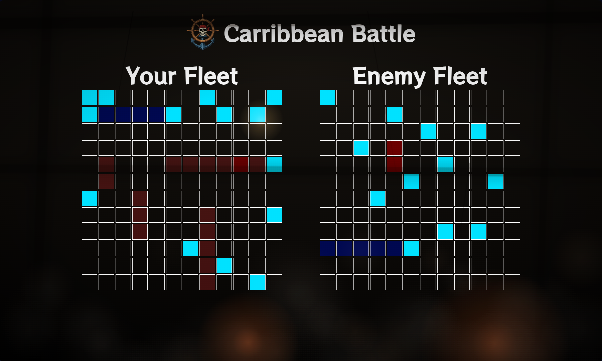

# Caribbean Battle - The Odin Project
This project is part of [The Odin Project](https://www.theodinproject.com) curriculum.
It is a battleships game set in the golden age of piracy.
 
## Preview
You can access the website [here](https://louis-dub.github.io/caribbean_battle_odin/).


 
## Features
On this app, you can:
- Place your ships on the grid, moving them with the arrow keys and rotating them with **R**
- Play against a computer opponent
- Use two grids: one to fire at the computer's ships, and one where the computer fires at yours
- Face a computer that plays intelligently, not just randomly

## Launch the project
### Prerequisites: Install Node.js
- On Windows
```powershell
winget install OpenJS.NodeJS.LTS
```
- On Linux (Debian/Ubuntu)
```bash
curl -fsSL https://deb.nodesource.com/setup_lts.x | sudo -E bash -
sudo apt-get install -y nodejs
```
### Clone the repo:
- With URL
```bash
git clone https://github.com/Louis-dub/caribbean_battle_odin.git
```
- With SSH
```bash
git clone git@github.com:Louis-dub/caribbean_battle_odin.git
```
### Install dependencies
```bash
npm ci
```
### Launch the project
```bash
npm run dev
```
### Launch tests
```bash
npm test
```

## Technologies used
- **HTML5**: For the semantic structure of the website
- **CSS3**: For custom styling
- **Node.js**: For providing a runtime environment to run Webpack
- **Webpack**: For bundling the JavaScript modules and deploying the app
- **Jest 30**: To test my functions
- **Babel 7**: To transpile the code so it can be understood by Jest

## What I learned
- Setting up separate dev and prod environments with Webpack, with minification and optimization enabled only for production builds
- Configuring Jest to work with the DOM (jsdom) in order to unit-test DOM manipulation, not just plain JS functions
- Building a bot with basic AI: it fires randomly until it lands a hit, then targets the surrounding cells to try to sink the ship
 
